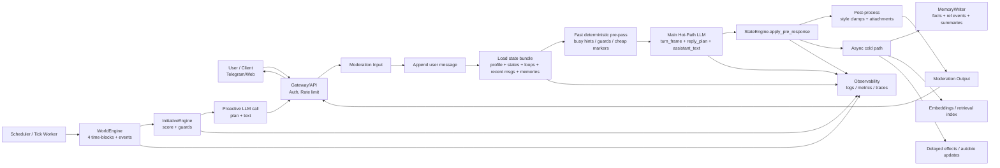

# Design-Doc: LLM-based project — AGI Artificial Girlfriend Intelligence

> Вторая версия плана проекта. Черновой design-doc для open-source ветки `llm_project_AGI`.

> Проект: чат-бот девушка, которая живёт в симуляции и не знает, что она в симуляции. Пользователь — “pen friend из другой вселенной”, который может писать ей сообщения.  
> Система состоит из трёх больших моделей/подсистем: **World Model** (внешний мир), **Internal World Model** (внутренний мир/личность), **Girl Model** (агент, который действует и общается).  
> Вокруг девушки — “малые модели” (NPC): начальник, лучшая подруга, коллега, одноклассники и т.д., которые влияют на её жизнь.

---

## 0. TL;DR

- **Дифференциатор продукта:** не просто чат с LLM, а **динамическая симуляция жизни**, где у персонажа есть события, небольшое окружение, развитие как с пользователем, так и возможно (сложно, пока не нужно) внутри своего мира.
- **Ключевые принципы:**
  1) Девушка не знает о том что живет симуляции.  
  2) Мир генерирует события независимо от пользователя.  
  3) Внутренний мир управляет мотивами, ценностями, характером, отношениями, предысторией.  
  4) Девушка-агент действует в мире и взаимодействует с пользователем исходя своего опыта.
- **Монетизация:** подписки, которые регулируют **детализацию мира** и **кол-во/сложность NPC**, частоту обновления мира, глубину памяти и дополнительные модальности (мемы/стикеры/картинки/походы в интернет).

---

## 1. Контекст проекта

### 1.1 Бизнес-задача

**Проблема / вызов**

Обычные LLM-чатботы скучны: у них нет жизни между сообщениями, нет независимых событий и причин возвращаться. Мы хотим сделать девушку, у которой:
- есть **жизнь в симулированном мире** (работа/учёба/друзья/события),
- есть **развитие личности** и отношений,
- есть **мультидневная связность** диалога,
- есть микро-интеракции (мемы/стикеры), которые усиливают реализм.
- есть инициатива, возможность писать самой не просто шаблонные сообщения вида: ``тебя давно не было'', а что то большее

**Почему это имеет смысл**

- Удержание и вовлечённость в таких компаньонах зависят от ощущения живости персонажа.
- Симуляция создаёт поводы для диалога без постоянного ведения со стороны пользователя.
- Подписки естественно масштабируют ценность: больше мира, больше окружения, больше глубины.

**Критерии успеха**

*Продуктовые / бизнес-метрики (минимум для MVP):*
- Retention: D1/D7/D30 (целевые значения задаются продуктом после пилота).
- Средняя длина сессии (messages/session) и частота возвращения.
- Конверсия в подписку (trial→paid), churn.
- CSAT/NPS/оценка реализма (встроенная оценка 1–5).

*Качество LLM/симуляции:*
- **Memory correctness:** доля корректных вспоминаний фактов пользователя в тест-наборе ≥ Y%.
- **World coherence:** низкая доля противоречий в событиях/таймлайне (пункт. 3.3).
- **Safety:** доля инцидентов (токсичность/NSFW/самоповреждение/утечки) ≤ Z%.
- Latency: p95 <= N секунд, стоимость сессии <= C.

---

### 1.2 Целевая аудитория и пользователи

**Кто пользуется**
- Внешние пользователи (B2C): общение как с человеком, эмоциональная поддержка/вовлечённость (без заявлений о терапии).
- Внутренние пользователи: команда (разработка/QA) для тестов симуляции, памяти и многошаговых диалогов.
- Судя по оценкам достаточно популярная вещь 

**Сценарии**
- Текстовый чат (основной): Telegram/Discord/Web/miniApp
- Инициатива: девушка сама пишет при событиях мира, или других триггерах (opt-in).
- Мемы/стикеры (желательно). Картинки — **опционально** (можно позже). Походы в поиск? 

**Нагрузка (оценка для MVP)**
- Пилот: 100–1 000 DAU, 5–20 сообщений/сессия.
- Пиковые часы: вечер по локальному времени.
- Пик: 5–20 RPS (с запасом).
- По идее фигня, поскольку везде API, даже faiss не нужен в теории 

---

### 1.3 Ограничения и допущения

**Ограничения**
- Нету своих моделей, все ограничено API, ft очень тяжелый и дает плохое качество 
- Девушка не должна ломать четвёртую стену, что часто побуждает к выдумыванию фактов и последующему их забыванию (долно решаться хорошей памятью)
- Сложная агентная система требует больших затрат для формирования хорошего ответа, согласованного с внутренним и внешним миром
- Возможно ли вообще сделать симуляцию очень реалистичной --- нам предстоит это выяснить  

**Риски**
- Галлюцинации о прошлом пользователя/девушки
- Неприемлемый контент (NSFW, hate, self-harm)
- Искуственность созданного мира 
- Обрыв API в одной из частей ломает все
- Слишком долгие ответы из-за большого количества API/обработки перед ответом 

---

## 2. Архитектура решения

### 2.1 Общая схема

#### 2.1.1 Концептуальная модель

Базовая конструкция такая:

- **Girl Profile**: почти неизменяемый слой личности Девушки — кто она, как говорит, что для неё важно, что её ранит, как выглядит её мягкость, усталость и обида
- **State Layer**: быстро меняющееся состояние:
  - `girl_state` — её день, энергия, стресс, одиночество, доступность, текущий режим;
  - `relationship_state` — warmth / trust / closeness / hurt / unresolved_tension и related axes;
  - `world_state` — где она, что происходит в её маленьком мире, какие NPC и события вокруг (не очень подробно, уточнить при исполнении); 
  - `open_loops` — незакрытые линии между ней и пользователем (завтра напишу, расскажу и тд).
- **Main Dialogue Model**: основной вызов модели в пайплайне. В норме это **один** вызов, который получает уже собранный state/context и возвращает:
  - `turn_frame`,
  - `reply_plan`,
  - `assistant_text`.
- **Deterministic Engines**:
  - `StateEngine` — считает изменения состояний;
  - `WorldEngine` — двигает маленький мир по time-block’ам и событиям;
  - `PolicyEngine` — ограничивает длину, тепло, уязвимость, split replies и т.д.;
  - `InitiativeEngine` — решает, писать ли первой.
- **NPC Layer**: маленький набор значимых фигур (например: Даша, Илья, Соня, опционально Никита), которые влияют на события дня и её состояние.
- **Memory Layer**: хранит не только facts, но и relational events, open loops, autobiographical continuity и common ground.
- **Runtime Layer**: Telegram/Web, per-chat serialization, proactive scheduler, moderation, observability.

#### 2.1.2 Техническая архитектура (low-latency MVP → scale)

- Основа лежит в miro, краткое описание:

---

### 2.2 Симуляция мира: state, ticks, события

#### 2.2.1 World State

В новой схеме внешний мир — это **не глобальный симулятор экономики, науки и катастроф**, а маленький плотный мир 

Состояние мира включает:
- город и набор повторяющихся мест:
  - квартира,
  - кухня,
  - дорога,
  - работа / студия,
  - кофейня,
  - улица / набережная;
- время:
  - `morning`,
  - `lunch`,
  - `evening`,
  - `late_night`;
- тип дня:
  - будний,
  - выходной;
- текущую activity:
  - едет,
  - работает,
  - дома,
  - разговаривает с NPC,
  - устала после дня и т.д.;
- 3–4 значимых NPC и их influence;
- малые события дня:
  - конфликт с боссом,
  - тихий вечер дома,
  - плохой сон,
  - бытовой сбой,
  - странный разговор с подругой,
  - маленькая победа,
  - неожиданное сообщение от старого человека.

**MVP-хранение:** file-based state рядом с текущим memory store (`json/jsonl` + embeddings/FAISS)  
**Scale-вариант:** PostgreSQL + pgvector / внешняя vector DB при росте продукта (верим верим).

#### 2.2.2 Simulation Tick

Мир двигается не как глобальная вселенная, а как **локальный ритм жизни Леры**.

- Тик — это переход сим-времени и её local world state.
- Базовый шаг: `time-block`
- При входе пользователя Orchestrator делает ограниченный `catch-up`, чтобы:
  - догнать день до текущего времени,
  - обновить её доступность,
  - применить 0–1 небольшое событие,
  - не крутить огромную историю мира.

#### 2.2.3 Event Model

События должны быть:
- локальными,
- объяснимыми,
- редкими,
- эмоционально полезными.

Хорошее соотношение:
- **70%** — обычная жизнь;
- **20%** — маленькие социальные и бытовые повороты;
- **10%** — действительно значимые эмоциональные события.

> Это важнее для правдоподобия, чем “богатая внешняя вселенная”. Непрерывный экшен быстро делает всё фальшивым.

---

### 2.3 Internal World Model 

Внутренний мир хранит не абстрактный “character core”, а конкретный набор устойчивых и динамических слоёв.

#### 2.3.1 Стабильный слой (`girl_profile`)
- имя, возраст, город, работа;
- ядро личности;
- ценности и анти-ценности;
- стиль речи;
- что ранит;
- как она конфликтует;
- как она проявляет тепло;
- как выглядит её инициатива

#### 2.3.2 Динамический слой (`girl_state`)
- настроение / current mode;
- энергия;
- стресс;
- одиночество;
- скука;
- выгорание;
- доступность;
- что делает в данный момент;
- отрезок времени;
- местоположенме.

#### 2.3.3 Отношенческий слой (`relationship_state`)
Что то типа:
- `warmth`
- `trust`
- `closeness`
- `hurt`
- `unresolved_tension`
- `ritual_strength`
- `romantic_tension`
- `perceived_safety`
- `perceived_reliability`

#### 2.3.4 Незакрытые линии (`open_loops`)
- обещания;
- недоговорённые темы;
- следы после уязвимого разговора;
- незавершённые конфликты и восстановление от обиды;
---

### 2.4 Girl Model 

“Girl Model” — это не отдельная независимая world-simulation-модель, а **основной аггрегатор состояний для получения промпта**, работающий поверх уже собранного состояния.

Он получает:
- ядро девушки (характер и другие неизменяемые штуки),
- текущий `girl_state`,
- `relationship_state`,
- `world_state`,
- `open_loops`,
- релевантную память,
- последние сообщения,
- как нужно отвечать.

В норме он возвращает:

- `turn_frame` — что произошло в этом turn;
- `reply_plan` — каким должен быть ответ;
- `assistant_text` — готовый текст ответа.

### Важное ограничение
В MVP агент не должен раскрывать “сырую архитектуру” или внутренний дебаг.
Все world references должны звучать **как естественный рассказ о своей жизни**, а не как системный лог.

---

#### Как примерно выглядит это все

1. Input moderation + rate limit.
2. Append user message.
3. Загрузка state bundle:
   - `girl_profile`,
   - `user_profile`,
   - `girl_state`,
   - `relationship_state`,
   - `world_state`,
   - `open_loops`,
   - последние K сообщений,
   - retrieved memories.
4. Fast deterministic pre-pass:
   - busy hints,
   - quiet-hours guards,
   - простые open-loop маркеры,
   - служебные команды.
5. Catch-up local simulation при необходимости.
6. **Main hot-path LLM call**:
   - `turn_frame`
   - `reply_plan`
   - `assistant_text`
7. `StateEngine.apply_pre_response(...)`
   - именно здесь состояние доезжает до актуального до отправки текста.
8. Post-processing:
   - стиль,
   - max length / emoji clamps,
   - sticker/meme if needed.
9. Output moderation.
10. Отправка ответа пользователю.
11. Async cold path:
   - memory writeback,
   - embeddings/index,
   - summaries,
   - delayed effects / autobio updates.
12. Логирование/метрики.

#### Инициатива 

1. Scheduler tick.
2. `WorldEngine.tick(chat)`.
3. `InitiativeEngine.score(chat)`.
4. Если `send = true`:
   - initiative plan,
   - proactive generation,
   - send,
   - `initiative_history` append,
   - state/log updates.

---

## 3. Данные и качество знаний

### 3.1 Сбор и предобработка данных

**Источники**
- Логи чатов.
- События симуляции (event log).
- Структурированные факты памяти.
- Каталог контента (мемы/стикеры/NPC профили).

**Предобработка**
- Маскирование PII в логах.
- Извлечение фактов (IE): “что можно запомнить”.
- Дедупликация воспоминаний.

---

### 3.2 Векторизация и индексирование

- Embeddings multilingual (RU/EN).
- Индекс: cosine similarity, HNSW.
- Обновление: инкрементально + периодическая пересборка при смене модели.

---

### 3.3 Метрики качества мира и памяти

**Memory correctness**
- Тест-набор фактов пользователя - % правильных ответов при “вспомни X”.

**World coherence**
- % противоречий в таймлайне (пример: “вчера была на работе” и “вчера была в другом городе” без объяснения).
- % ошибок симуляции (упоминание симуляции без разрешения).

**Narrative quality**
- Оценка интересности событий (rubric + пользовательский фидбэк).
- Доля пустых дней без событий (если это плохо для продукта).

---
## 4. Модель и генерация

### 4.1 Выбор LLM и промптинг

**Модельная стратегия**
- Girl Agent: более сильная модель.
- NPC/World: можно использовать более дешёвую модель или правила + LLM.
- Internal World: можно делать как LLM-обновление состояния (structured update) или как отдельный “state machine”.

**Промпты**
- System: персонаж, стиль, границы, “не знает о симуляции”.
- Developer: формат выходов + инструменты + политика памяти.
- Context: история, memory retrieval, world/internal snapshots.

**Формат выхода**
- `assistant_text`
- `attachments` (sticker/meme)
- `actions[]` (tool calls в симуляцию)
- `memory_writeback` (facts + summaries)
- `state_updates` (internal/world diffs)

---

### 4.2 Контроль качества ответов

- Input/Output moderation.
- Confidence gating для памяти: если уверенность низкая → уточнять, а не “придумывать”.
- Ограничение “интернет-инструментов”.
- Фоллбек: безопасный ответ + уточнение.

---

### 4.3 Дообучение

MVP — без fine-tune. Далее:
- preference tuning по лайкам/дизлайкам,
- набор стремных примеров,
- версионирование промптов/моделей + rollback
- Грок 4 нельзя дообучить а гпт слишком зацензурена -> свои модели

---

## 5. UX / пользовательский опыт

### 5.1 Сценарии взаимодействия

**Основные сценарии**
- Daily chat + что у тебя произошло сегодня?/ по настроению
- Storytelling: девушка делится событиями мира
- Advice loop: пользователь советует, девушка (агент) может действовать
- Микро-реакции: мем/стикер
- Память: помнит что произошло, может шутить/использовать это в своих диалогах 

**Исключительные**
- “Не поняла” → уточняющий вопрос.
- “Не могу” (tools) → объяснение в стиле персонажа + альтернативы.
- Safety: корректный отказ + поддержка + ресурсы, если self-harm
- Возможноть девушки забанить пользователя (разбан за \$\$\$)

---

### 5.2 Диалоговая логика и контекст

- Single-turn fallback vs multi-turn stateful
- История: последние K сообщений + summary
- Память: top-N релевантных воспоминаний

---

## 6. Безопасность, соответствие и этика

- Фильтры NSFW/violence/hate/self-harm
- Анти-манипулятивные правила: не давить, не шантажировать, не провоцировать зависимость
- Защита от атак на память и тд
- Приватность: opt-in память, delete/export данных, маскирование PII

---

## 7. План внедрения и эксплуатации

### 7.1 Этапы

**Фаза 0 — дизайн и тестовый рубрикатор (несколько дней)**
- Схемы состояния (world/internal/memory).
- Набор сценариев и “спотыкаемых” примеров.

**Фаза 1 — MVP**
- Girl Agent + Memory v1.
- World v1: простые события по расписанию (скрипты + LLM-нарратив).
- Internal v1: базовые параметры (настроение/энергия/отношения).
- Мемы/стикеры v1.
- Базовый мониторинг.

**Фаза 2 — Симуляция как продукт**
- World v2: richer events, экономика/новости (ограниченно), редкие катастрофы.
- NPC v1: подруга/босс (2–3 NPC).
- Self-play benchmark (бот↔бот) для длинных диалогов (100+ сообщений).

**Фаза 3 — Масштабирование + подписки**
- Подписочные уровни, feature gating.
- Опционально: интернет-инструменты, картинки.
- Оптимизация стоимости: модели-микс, суммаризация, кэш.

### 7.2 Поддержка

- Дашборды: latency, cost/session, safety incidents, memory recall.
- Регресс-тест: сценарии мира/памяти/тона на каждую версию.
- Процесс обновления контента (мемы/стикеры/NPC): ревью + versioning.

---

## 8. Риски и допущения

| Риск | Вероятность | Влияние | Mitigation |
|---|---:|---:|---|
| Длинные диалоги сложно оценивать | Высокая | Высокое | self-play + LLM-judge + ручные выборки |
| “Слом симуляции” (мета-упоминания) | Средняя | Высокое | правила в system prompt + тесты на “четвёртую стену” |
| Противоречия в мире (таймлайн) | Высокая | Высокое | event-sourcing + инварианты + coherence checks |
| Стоимость растёт с NPC/тиками | Высокая | Высокое | tier gating, дешёвые модели для NPC, частичный rule-based |
| Эмоциональные риски/зависимость | Средняя | Высокое | политика поведения, ограничение манипулятивных паттернов |
| PII/приватность | Средняя | Высокое | opt-in память, маскирование, delete/export |

**Непроверенные допущения**
- Пользователям действительно важна “жизнь между сообщениями”, а не только стиль общения.
- Подписочные уровни с “больше мира/больше NPC” воспринимаются как честная ценность.

---

## 9. Бюджет, ресурсы и монетизация

### 9.1 Подписки (предложение)

**Free**
- 1 девушка, базовый мир (низкая детализация), 0–1 NPC.
- Ограниченная память/контекст, редкие тики.
- Мемы/стикеры — базовый набор.

**Plus**
- Более детальный мир, 2–5 NPC, проработка мира 
- Больше тиков (богаче события), глубже память
- Агенты умнее 
- Больше контента (мемы/стикеры), проактивные сообщения 

**Premium**
- Rich simulation: больше локаций, событий
- Персонализация мира/тем, расширенная память, приоритет по ответам 
- Все агенты еще умнее (более дорогие модели)
- Опционально: картинки/интернет-инструменты 

### 9.2 Cost drivers

- Токены Girl Agent (главный драйвер).
- NPC трафик (кол-во агентов × тики × стоимость модели).
- Embeddings + vector search.
- Логи и хранение.

---

### 10 Чек-лист

- [ ] Opt-in на память + delete/export
- [ ] Input/Output moderation
- [ ] Тесты на память с мультитерн большими сессиями
- [ ] Тесты на не выход из образа девушки 
- [ ] Метрики latency/cost/safety/memory usage/...
